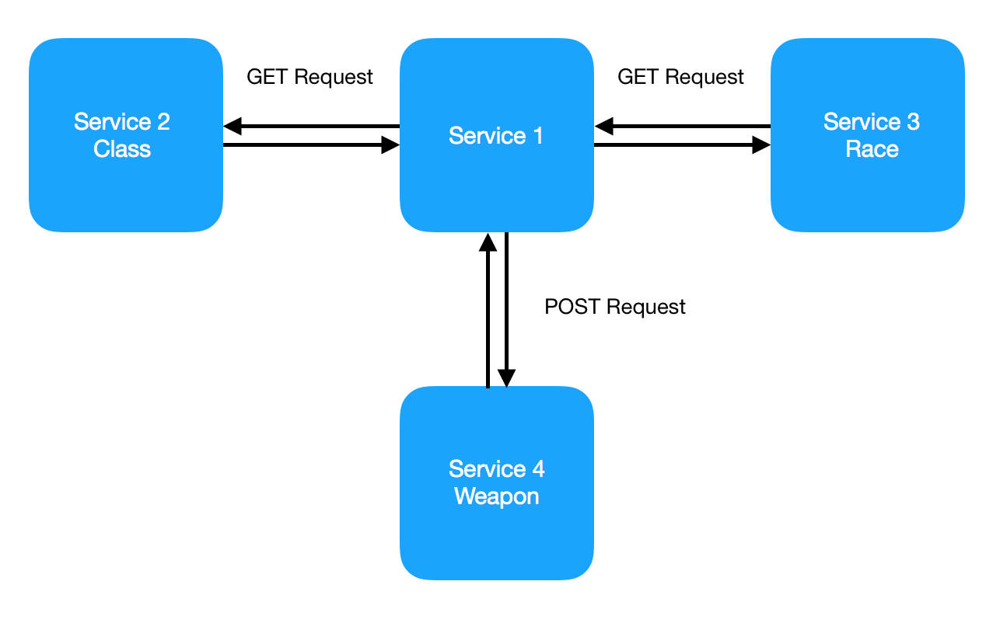
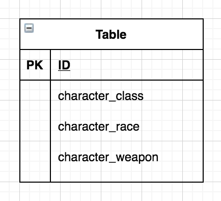
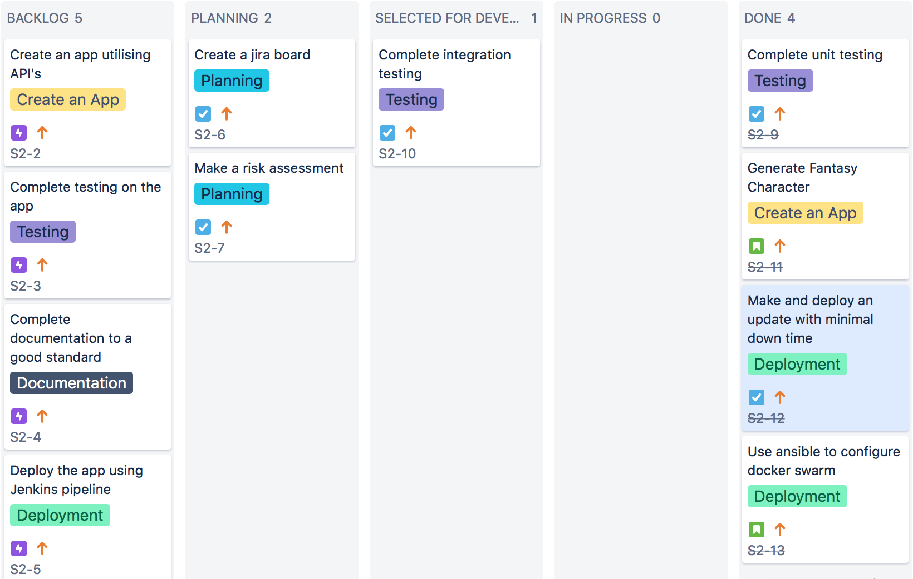
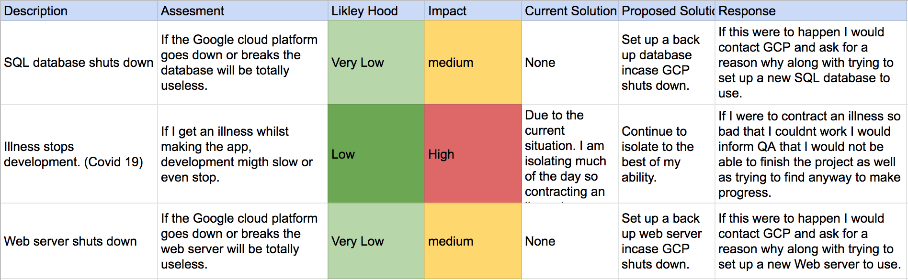
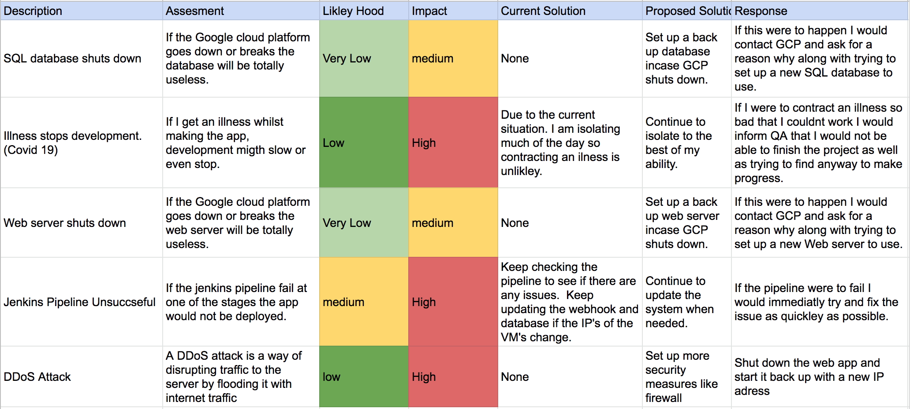
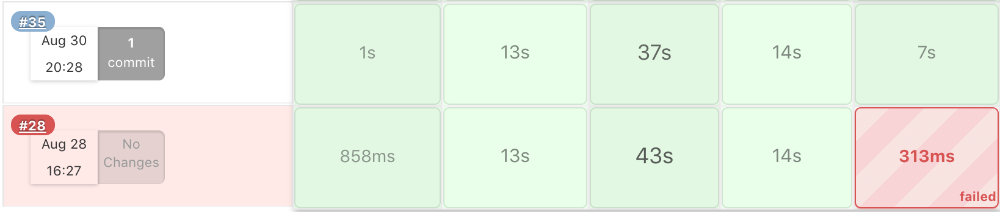
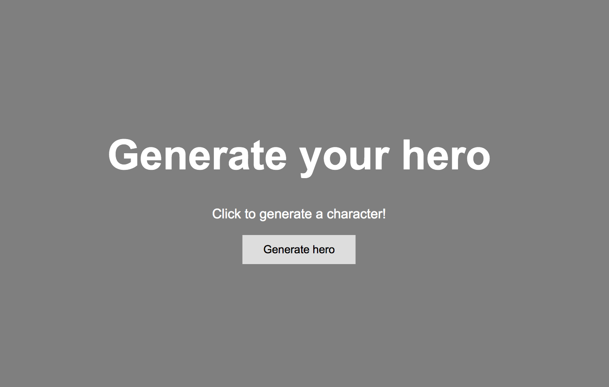
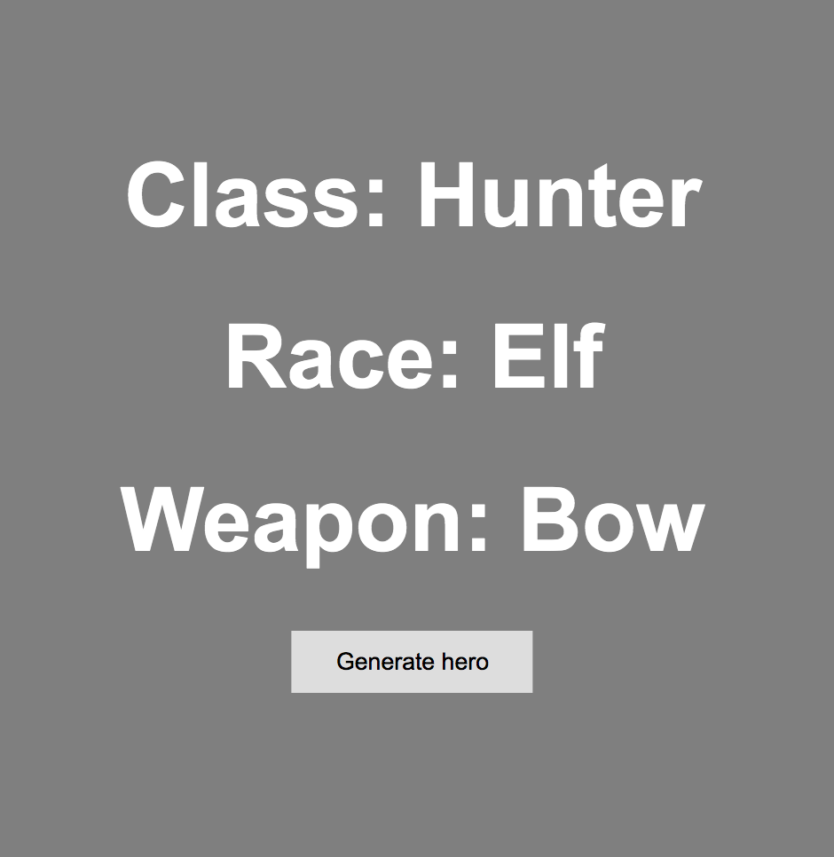
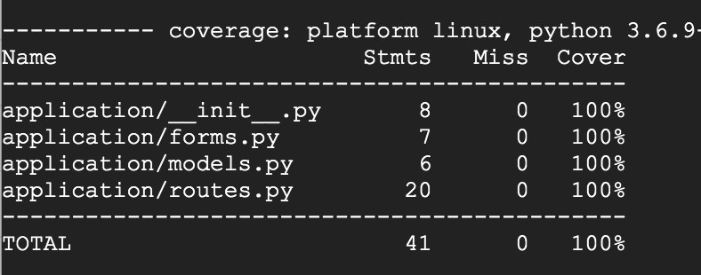
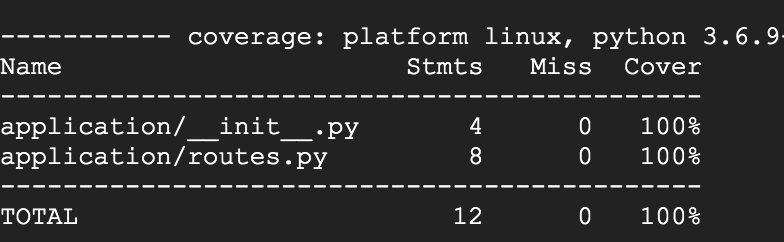

# QA-SFIA-2

<!-- TABLE OF CONTENTS -->
## Table of Contents

* [About the Project](#about-the-project)
* [Entity Relationship Diagram](#entity-relationship-diagram)
* [Jira Board](#jira-board)
* [Risk Analysis](#risk-analysis)
* [CI Pipeline](#ci-pipeline)
* [Deployment](#deployment)
* [Front End Design](#front-end-design)
* [Testing](#testing)
* [Whats Wrong](#whats-wrong)
* [Future Improvements](#future-improvements)
* [Author](#author)

<!-- ABOUT THE PROJECT -->
## About The Project

Main Objectives:
* Create a Jira board with full expansion on tasks needed to complete the project.
* This could also provide a record of any issues or risks that you faced creating your project.
* Create ann Application with fully integrated using the Feature-Branch model into a Version Control System which will subsequently be built through a CI server and deployed to a cloud-based virtual machine.
* If a change is made to a code base, then Webhooks should be used so that Jenkins recreates and redeploys the changed application
* The project must follow the Service-oriented architecture that has been asked for.
* The project must be deployed using containerisation and an orchestration tool.
* As part of the project, you need to create an Ansible Playbook that will provision the environment that your application needs to run.
* The project must make use of a reverse proxy to make your application accessible to the user.

## My App Idea

My idea was very simple and consisted of an app that, when used, generated a character's class, race and weapon.  I did this by using APIs.  Specifically 3 separate APIs, two of which I made get requests to, to acquire the race and class of the character.  Then one that I made a post request to, to get the weapon based on the character's class that was attained earlier. The data collected is then placed on to a database and is then shown on the webpage using an SQLAlchemy query. Below is a little diagram on how my app interacts with the APIs.

## Entity Relationship Diagram

Below is a little entity relationship diagram that shows how my database was set out.  Because the minimal vaible product for this project only needed one database with one table, that is what I did.  This helped my keep my project simple so that I could focus on completeing every aspect to a good standard.

## Jira Board

I used Jira to plan out and keep track of my project. I used a Kanban board with full expansion on user stories, use cases and tasks needed to complete the project. It also helps keeping track of any issues or risks that I faced whilst completing the project.

Here is a link to my Jira board: https://project-2-sfia.atlassian.net/secure/RapidBoard.jspa?projectKey=S2&useStoredSettings=true&rapidView=1

## Risk Analysis

Below is a risk assessment that I carried out to help me identify the potential risks and problems that could arise whilst developing or after developing my project. By doing this I could then figure out ways of preventing these problems so that I am prepared if they ever do arise.

### First Risk Assessment

### Final Risk Assessment

## CI Pipeline 

Below is the CI Pipeline that describes my project.  The tools used for each section are also detailed below.

* Kanban Board: Jira
* Version Control: Git/Github
* CI Server: Jenkins
* Configuration Management: Ansible
* Cloud server: GCP virtual machines
* Containerisation: Docker
* Orchestration Tool: Docker Swarm
* Reverse Proxy: NGINX

### Initial CI Pipeline

### Finished CI Pipeline

## Deployment

To deploy the app I utilised the automation features that Jenkins provides.  I did this by using the pipeline feature to automate the use of Ansible and Docker. I also added a webhook so that after making a commit to my GitHub project, Jenkins will trigger a pipeline job. The pipeline uses a Jenkinsfile in the project to run the different stages of the pipeline.  This is because they are outlined in the Jenkinsfile. In order to simplify the Jenkinsfile, I split each step into separate scripts that handle a different stages of the pipeline. First, Jenkins will then run all my unit tests, and if they pass, it will move on to the next stage.  The next stage will run my ansible playbook.  This configures my docker swarm manager and worker so that the app can be deployed onto them.  The next stage then logs in to docker hub and creates and pushes the images of the app to my dockerhub.  The final stage then deploys the app using docker stack.

As seen above, when a stage fails it comes up red.  When this happened I checked the console output to see what went wrong and then fixed the problems.  Fixing the problem then leads to a successful build.

## Front end Design

The images below show the design of my app:

## Testing

Pytest is used to run unit tests on the app. These are designed to assert that if a certain function is run correctly, the output should be a known value. Pytest produces coverage reports (Which you can see below) that show how much of the app the tests cover. In this case it was 100%.

For this project I decided not to run any integration testing. I did this because the MVP needed for passing this project didn't include integration testing so I made the choice of leaving it out to focus on the more important features that were needed to pass the project.

For the unit testing I used the (pytest --cov application --cov-report term-missing) command to see the lines of my files that hadn't been covered by the tests. I could then target those lines by writing more tests.

### Service one

### Service 2 and 3

### Service 4

## Whats Wrong

* There is approximately 8 seconds of downtime when an update is applied to the app.

## Future Improvements

* One improvement I would like to make is adding integration testing onto the app. This will help test the app to a higher standard and make sure it is working fully before deployment.

* Although I think the front end design is definitely better than last time, I do think it could be improved with the use of css.

 ## Author
 

 Bradley Daniels
